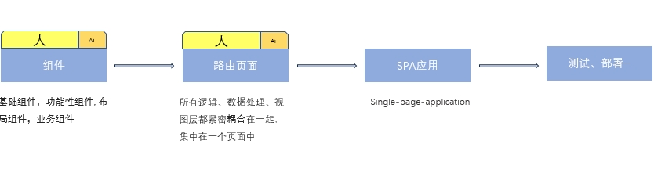

# AI工具深入前端开发工作流程中探索分析

> **简述：通过Ai辅助编程工具的优劣势分析，优化现阶段前端页面开发工作流，探索开发与Ai的深度结合**


> [目录](#目录)
> [一. AI辅助编程的现状](#一-ai辅助编程的现状)
> 
>> [1.  IDE模式：例如`Cursor`，`GitHub Copilot`](#1--ide模式例如cursorgithub-copilot)
>>
>> [2.  Prompt模式：例如`ChatGPT`](#2--prompt模式例如chatgpt)
>>
>> [3.  Agent模式：例如Cline（智能调试与错误修复模式 和 自动化代码生成模式）](#3--agent模式例如cline智能调试与错误修复模式-和-自动化代码生成模式)
>
>> [4. 总结](#4-总结)
>
> [二. 前端开发现阶段对AI工具的应用](#二-前端开发现阶段对ai工具的应用)
>
>> [1. 现阶段的前端SPA项目的开发流程：](#1-现阶段的前端spa项目的开发流程)
>>
>> [2. 我们现在正在使用的AI辅助方式：](#2-我们现在正在使用的ai辅助方式)
>>
>> [3. 现有的开发的问题 与  AI的优劣势](#3-现有的开发的问题-与--ai的优劣势)
>
> [三. 结合Ai的优势和局限性，优化现有开发工作流，与Ai深度融合](#三-结合ai的优势和局限性优化现有开发工作流与ai深度融合)
> 
>> [1. 工作流程模块深度拆分：](#1-工作流程模块深度拆分)
>>
>> [2. 元组件模块大部分是已有组件库的，所以开发的重点部分就是：`业务组件模块`](#2-元组件模块大部分是已有组件库的所以开发的重点部分就是业务组件模块)
>>
>
> [四. 为什么Ai生成JavaScript前端代码比java或者其他脚本语言更具有挑战尼？](#四-为什么ai生成javascript前端代码比java或者其他脚本语言更具有挑战尼)
>
> [五. 展望和未来](#五-展望和未来)


## 一. AI辅助编程的现状

##### 1.  IDE模式：例如`Cursor`，`GitHub Copilot`
1. 描述：代码补全工具，只能分析上下文和用户输入，生成相关代码片段， 显著提高开发者编程效率。
2. 适合人群：高级开发者，团队协作
3. 优势和局限性(cursor为例)
    - 优势
        1. 提高编码速度，减少重复输入。
        2. 与 IDE 的紧密集成，开发者沉浸式的编码体验，使其在开发者日常工作流程中高效且无缝。
        3. 支持基于项目上下文的代码生成和优化，特别适合快速开发和调整代码。
    - 局限性
        1. 对于复杂的业务逻辑或特定的系统架构设计，生成的代码可能需要大量调整。
        2. 生成的代码片段可能在性能或安全性上存在缺陷，需要开发者逐个审查。

##### 2.  Prompt模式：例如`ChatGPT`
1. 描述：根据自然语言生成代码块，然后开发者将其整合到项目中
2. 适合人群：初学者
3. 优势和局限性
    - 优势:
        1. 能够支持多种编程语言，回答广泛的技术问题。
        2. 支持复杂的自然语言查询，可以生成代码、调试建议和学习材料。
        3. 整合了强大的知识库，适用于开发者、产品人员以及学生。
    - 局限性:
        1. 生成的代码不总是完全准确，尤其是在非常具体或复杂的任务中。
        2. 对于特定项目的上下文理解有限，可能需要手动调整生成的代码。

##### 3.  Agent模式：例如Cline（智能调试与错误修复模式 和 自动化代码生成模式）
1. 描述：`Cline` 自动化代码助手，能够在编辑器中自动分析代码、生成、编辑文件，甚至执行命令。它具备一定的自动化能力，支持开发者通过自然语言描述需求来生成相对复杂代码并进行调试，注重开发环境的整合和深度分析。
2. 适合人群：开发团队和高级开发者
3. 优势和局限性
    - 优势：
        1. 具备自动化代码生成、调试和错误修复功能，可以减少开发者的重复劳动。
        2. 深度集成开发环境（IDE），能够自动执行命令、分析项目结构，并提供有效的修改建议。
        3. 支持代码创建、编辑、终端操作以及捕获错误等操作。
    - 局限性：
        1. 由于自动化程度较高，开发者需要对其生成的代码和执行的操作进行仔细审查，以确保安全性和代码质量。
        2. 对于复杂的项目，整体需求的上下文可能变得模糊，导致生成的代码不符合预期
        3. 执行失败：复杂的需求涉及多个业务逻辑和数据交互，从而导致执行失败或生成不完整的代码
        4. 调试困难：如果最终代码或逻辑出错，查找和修复问题的过程可能会变得更加困难，因为需要在复杂的代码结构中进行排查。
        5. 缺乏灵活性：AI 生成的代码往往是基于预设模板，处理复杂需求时可能缺乏灵活性，不能适应特定业务的变化。
        6. API使用成本大，输入每百万tokens是3美元，输出每百万tokens是15美元

##### 4. 总结
  > IDE和Agent模式本质上都是Prompt模式的变种，但Agent模式更像是AI程序员的初级尝试，使开发者能够更专注于高层设计，将重复性任务交给AI处理，显著的提高开发效率。

## 二. 前端开发现阶段对AI工具的应用

##### 1. 现阶段的前端SPA项目的开发流程：


#### 2. 我们现在正在使用的AI辅助方式：
   1. API方法资料 查找，代码解释 （各种插件库的API）
   2. 开发方案查找验证 （编码思路是否正确）
   3. 辅助性函数编写，封装 （数据转化， 数据查找，函数抽象）
   4. IDE的代码提示，代码注释，代码预测
   5. 单元测试生成

##### 3. 现有的开发的问题 与  AI的优劣势
  
  
> 1. 开发： 开发人员为了更快的效率和交付，开发过程中逻辑和视图的虽然进行了模块的分离，提取， 但是部分组件逻辑，数据处理，视图层紧密耦合，路由页面中除了处理本身的数据逻辑，处理UI展示的仍然占很大一部分。

>  2. Ai: 如果不拆分需求，让AI执行复杂任务时，涉及多个业务逻辑和数据交互，导致生成的代码不符合预期，非常不可靠，会增大工作难度，调式困难；如果拆分过细，那么大量的prompt问答将会占用更长的开发时间，协作成本增加。
4. 那么能否对开发流程进行更细粒度的模块划分，使得Ai得到恰当的任务粒度，高效参与其中尼？

## 三. 结合Ai的优势和局限性，优化现有开发工作流，与Ai深度融合


##### 1. 工作流程模块深度拆分： 
- 元组件/基础组件 => 业务组件/复杂组件/定制化组件 => 路由页面/页面组件 => SPA应用
> 1. `元组件（Meta/Base Components）`
>     1. 定义：元组件是应用中最小、最通用的 UI 元素，通常是功能独立且可复用的组件。它们与具体的业务逻辑无关，可以在整个应用的不同场景中重复使用。
>     2. 职责：
>         - 提供基础的 UI 元素，如按钮、输入框、表单项等。
>         - 保持高度的可复用性，避免冗余代码。
>         - 封装常见的功能，例如表单输入、布局管理、通用样式等。
>     3. 作用：
>         - 提高开发效率，减少重复代码。
>         - 保证一致的设计语言和行为模式。
>     4. 示例：按钮（Button）、输入框（Input）、复选框（Checkbox）、对话框（Dialog）等。
> 2. `业务组件（Business Components）`
>     1. 定义：业务组件是与特定业务逻辑相关的组件，它们将基础组件组合在一起，处理业务需求和特定功能。业务组件通常是根据应用的业务场景定制的。
>     2. 职责：
>        - 实现特定的业务功能或者复杂功能。
>        - 负责与数据进行交互，处理逻辑并呈现 UI。
>        - 组合基础组件，提供与业务相关的功能集。
>     3. 作用：
>        - 处理特定业务逻辑，封装复杂的功能，简化页面开发。
>        - 提供面向业务的可复用模块，保持代码的清晰和可维护性。
> 3. `路由页面/页面组件（Pages/Views）`
>    1. 定义：前端页面是最终展示给用户的视图，通常是由多个基础组件和业务组件构成。每个页面代表应用中的一个独立视图或功能模块。
>    2. 职责：
>       - 组织和展示多个业务组件，实现整个页面的功能。
>       - 负责处理页面级的状态管理和路由逻辑。
>       - 管理用户的交互流程。
>    3. 作用：提供完整的功能界面和用户体验。整合不同的组件，形成具体的页面逻辑，响应用户操作。
>    4. 示例：用户登录页、产品详情页、订单管理页等。

##### 2. 元组件模块大部分是已有组件库的，所以开发的重点部分就是：`业务组件模块`
  1. 开发人员结合经验优势，按照独立性和复用性尽可能得对业务进行抽离、拆分
  2. 业务组件的开发必须要满足以下规范：
  ```sh
    1. 可以是多个基础组件的组合，也可以是多个业务组件的组合，使用方式必须跟基础组件一致。
    2. 高度内聚，功能职责清晰，能独立运行，有自己内部状态。
    3. 符合一进一出的原则（value, change）数据流向清晰，及时响应父组件的传入数据，同时能对用户交互后的数据变更进行通知。
  ```


  3. 尝试让AI专注接管业务组件的开发流程（demo举例子）：
      1. <a taget="_balck" href="./re-role.html">设定角色</a>
      2. 基础组件库读取
      3. <a taget="_balck" href="./re-prompt.html">需求功能描述 => 生成prompt</a>  
      4. 代码微调，优化, 审查
  
  


## 四. 为什么Ai生成JavaScript前端代码比java或者其他脚本语言更具有挑战尼？
##### 1. 前端框架和工具的频繁更新，没有明确的规范
> - 前端技术更新极快，新的框架、库、工具链层出不穷。比如从 jQuery 到 Vue、React、Svelte，甚至 CSS 的处理方式也在不断演进（如从 CSS 到 Sass、CSS-in-JS）。这种快速迭代让 AI 难以持续跟踪最新的最佳实践。

> - 后端技术栈的变化通常较慢，基础架构（如 Django、Spring、Node.js）较为稳定。AI 对后端或脚本语言的生成需求相对固定，不需要频繁更新。

##### 2. 用户界面和交互的复杂性
> - 前端代码不仅仅是逻辑实现，还包括界面布局、用户交互、响应式设计和动态效果，跨浏览器兼容性等。这种代码往往涉及更复杂的设计规则和主观因素。

##### 3. 跨平台和兼容性
> - 前端代码需要适配多种浏览器和设备，并确保在不同屏幕尺寸上都能正常显示，这对代码的响应性、兼容性有较高要求。因为需要准确处理 CSS、JavaScript API 的跨浏览器差异。
##### 4. 前端生成代码的多样化和创新要求
> - 前端的多样性让代码生成有更高的创新需求。比如相同的列表展示，可以用表格、卡片、网格等多种方式呈现，不同布局和样式会影响整体视觉效果和用户体验。AI 生成代码时难以确保“最佳实现”，因为有太多选择和主观标准。

## 五. 展望和未来
  Ai在前端领域应用潜力巨大，我们要去不断探索、学习、适应新的开发模式，全力拥抱Ai的同时，也要保持个性化和创新性。
